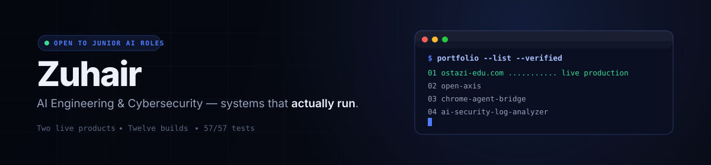
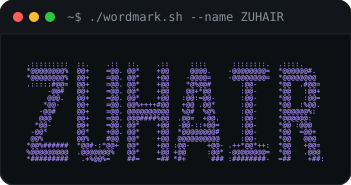

<h1 align="center">Hey, I'm Zuhair 👋</h1>

<b>AI Engineering & Cybersecurity student</b> at the Syrian Private University. 
I build <i>complete working systems</i> — not tutorials — and document what works, what doesn't, and why.

---

  

### 🧭 What I'm about

- **Systems over snippets** — every repo below is architecture + working code + real tests
- **Local-first AI** — Ollama pipelines with zero paid API keys, hallucination-guards by construction
- **Honesty as a feature** — synthetic data clearly labeled, real limitations documented instead of hidden

### 🔨 Flagship builds

| | Project | What it is |
|---|---|---|
| 🚀 | **[TutorLink-Syria → Ostazi](https://github.com/Zuhair-01/TutorLink-Syria)** | Live production tutoring marketplace (ostazi-edu.com): OTP auth, booking state machine, commission ledger, institute accounts |
| 🛒 | **[alwazour](https://github.com/Zuhair-01/alwazour)** | Live technology-supply storefront for a Damascus business (alwazour.vercel.app) — Arabic RTL catalog, product inquiry flow |
| 🧠 | **[open-axis](https://github.com/Zuhair-01/open-axis)** | Local control plane routing engineering tasks across Claude Code / OpenCode / Codex — tier routing, deterministic fallback · 45/45 tests |
| 🌉 | **[chrome-agent-bridge](https://github.com/Zuhair-01/chrome-agent-bridge)** | Universal CDP-native Chrome control for *any* AI agent — OpenCode, Codex, Claude, anything with a shell |
| 🧩 | **[kyros](https://github.com/Zuhair-01/kyros)** | Deterministic task-routing dispatcher + GPU mutex for local/cloud AI model orchestration · 16/16 tests |
| 📈 | **[nabd](https://github.com/Zuhair-01/nabd)** | Free-first B2B sales-intelligence engine — buying-signal detection, ICP discovery, transparent scoring. Archived, code complete |
| 📊 | **[enterprise-bi-platform](https://github.com/Zuhair-01/enterprise-bi-platform)** | BI dashboard over a real CSV validation/cleaning/transform pipeline |
| 📄 | **[ai-contract-intelligence](https://github.com/Zuhair-01/ai-contract-intelligence)** | Local-LLM contract extraction that reports missing fields honestly. Zero API keys |
| 🛡️ | **[ai-security-log-analyzer](https://github.com/Zuhair-01/ai-security-log-analyzer)** | Deterministic detection engine (brute force, impossible travel, port scans) + LLM summaries · 12/12 tests |

<b>More from the workshop</b>

 

- **[personal-brand-engine](https://github.com/Zuhair-01/personal-brand-engine)** — drafts social posts from finished projects; review-then-approve
- **[editor-intel](https://github.com/Zuhair-01/editor-intel)** — presets and interview prep tooling built around Claude Code / Kyros
- **[the full workshop →](https://github.com/Zuhair-01?tab=repositories)**

### 📈 GitHub stats

<picture>
<source media="(prefers-color-scheme: dark)" srcset="https://github-readme-stats-git-master-rickstaa.vercel.app/api?username=Zuhair-01&show_icons=true&hide_border=true&bg_color=00000000&title_color=eef1fb&text_color=9aa3bd&icon_color=6d8bff">

</picture>
<picture>
<source media="(prefers-color-scheme: dark)" srcset="https://github-readme-stats-git-master-rickstaa.vercel.app/api/top-langs/?username=Zuhair-01&layout=compact&hide_border=true&bg_color=00000000&title_color=eef1fb&text_color=9aa3bd">

</picture>

### 🤝 Let's talk

I'm open to **junior AI engineering / data / automation roles** where I can contribute and grow into enterprise-scale systems.

<a href="mailto:bizwithzuhair@gmail.com">Email</a> ·
<a href="https://zuhair-01.github.io/portfolio/">Portfolio</a> ·
<a href="https://www.linkedin.com/in/zuhair-wazz-3a748a34b/">LinkedIn</a> ·
<a href="https://www.ostazi-edu.com">See my live product</a>

